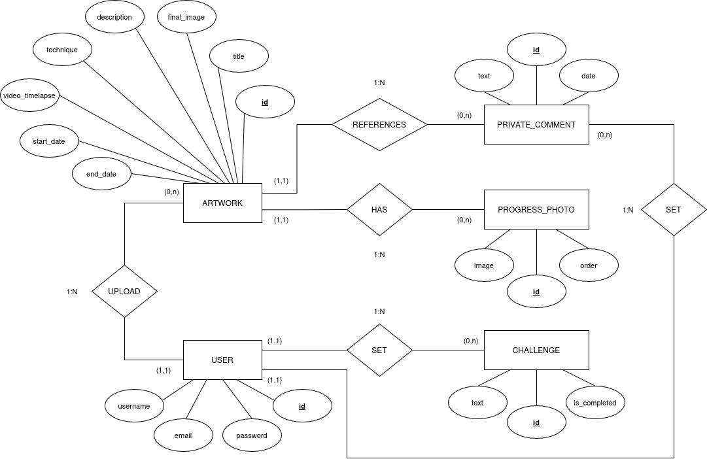

#ESQUEMA E/R DE ARTIFOLIO

**Python version:** 3.13.x

### Create a virtual environment (Linux/Windows)

`python3 -m venv env`
("env" is the name I've assigned to it; you can replace it with whatever you prefer.)

### Activate the virtual environment

**Windows:**
`.\env\Scripts\Activate.ps1`
*Make sure the path matches the name of your virtual environment if you named it differently.*

> If the system does not allow scripts to run, try `Set-ExecutionPolicy -ExecutionPolicy Bypass -Scope Process` and run the command above again.

**Linux:**
`source env/bin/activate`
*Make sure the path matches the name of your virtual environment if you named it differently.*

### Install dependencies (Linux/Windows)
**Linux:** `pip install -r requirements.txt`
**Windows:** `pip install -r .\requirements.txt`

### Launch the database container (Linux/Windows)
`docker-compose up -d`

### Start the server (Linux/Windows)
**Linux:** `python3 manage.py runserver`
**Windows:** `python3 .\manage.py runserver`

> If you encounter an error when accessing the page, migrations may be necessary. Try this:

**Linux:**
1. `python3 manage.py makemigrations`
2. `python3 manage.py migrate`

**Windows:**
1. `python3 .\manage.py makemigrations`
2. `python3 .\manage.py migrate`